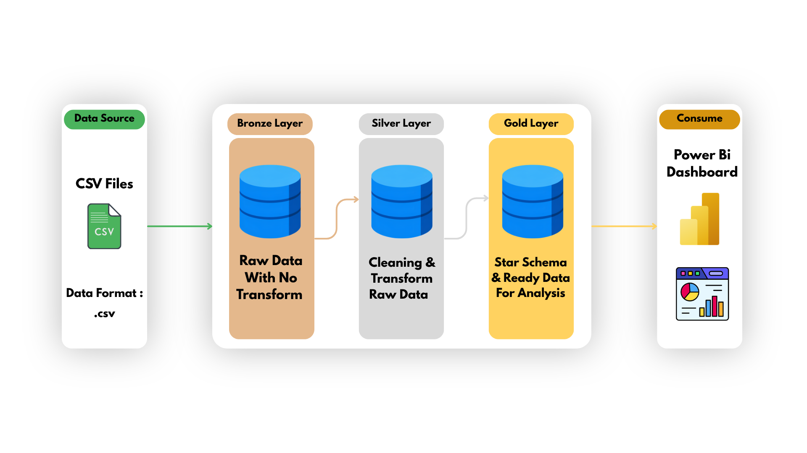
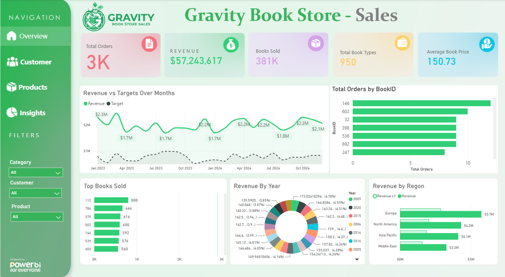

# 📚 Gravity Bookstore Data Warehouse

An end-to-end Data Engineering project that transforms raw bookstore data into clean, structured, and analytics-ready datasets using Python, Pandas, SQL Server, and Power BI.

The project follows the **Medallion Architecture (Bronze, Silver, and Gold)** to organize data ingestion, cleaning, transformation, and analytical reporting.

---

## 🎯 Project Objectives

- Build an end-to-end ETL pipeline for bookstore data.
- Ingest raw data from multiple CSV files using Python and Pandas.
- Store source data in the Bronze layer using SQL Server.
- Clean, standardize, and transform data in the Silver layer.
- Prepare analytics-ready datasets in the Gold layer.
- Organize the warehouse using separate database schemas.
- Build a Power BI dashboard to monitor key business metrics.
- Apply practical Data Engineering concepts, including data ingestion, data quality, database design, and data warehousing.

---

## 🏗️ Data Architecture

The project follows a layered Data Warehouse architecture based on the Medallion Architecture.

<p align="center">
  
</p>

The architecture follows this flow:

CSV Files → Python & Pandas → Bronze → Silver → Gold → Power BI

The project uses a layered data warehouse architecture based on the Medallion Architecture.

```text
                   ┌──────────────────────┐
                   │      Source Data     │
                   │       CSV Files      │
                   └──────────┬───────────┘
                              │
                              ▼
                   ┌──────────────────────┐
                   │   Python + Pandas     │
                   │    Data Ingestion    │
                   └──────────┬───────────┘
                              │
                              ▼
                   ┌──────────────────────┐
                   │     Bronze Layer     │
                   │     Raw Data         │
                   └──────────┬───────────┘
                              │
                              ▼
                   ┌──────────────────────┐
                   │  Python + Pandas     │
                   │  Data Cleaning       │
                   └──────────┬───────────┘
                              │
                              ▼
                   ┌──────────────────────┐
                   │     Silver Layer     │
                   │ Cleaned & Standardized│
                   └──────────┬───────────┘
                              │
                              ▼
                   ┌──────────────────────┐
                   │      SQL + Python    │
                   │ Data Transformation  │
                   └──────────┬───────────┘
                              │
                              ▼
                   ┌──────────────────────┐
                   │      Gold Layer      │
                   │ Analytics-Ready Data │
                   └──────────┬───────────┘
                              │
                              ▼
                   ┌──────────────────────┐
                   │       Power BI       │
                   │ Dashboard & Insights │
                   └──────────────────────┘
```

### 🥉 Bronze Layer — Raw Data

Stores data ingested from the original CSV files in SQL Server tables.

### 🥈 Silver Layer — Cleaned Data

Handles missing values, data type conversions, standardization, and data cleaning according to business rules.

### 🥇 Gold Layer — Analytics-Ready Data

Contains prepared datasets for sales, books, authors, and customers, making the data suitable for reporting and analysis.

---

## 🔄 End-to-End Data Pipeline

The pipeline follows these stages:

1. **Extract:** Read the source CSV files using Python and Pandas.
2. **Load:** Insert the raw data into SQL Server Bronze tables using PyODBC.
3. **Clean:** Handle missing values and standardize the source data.
4. **Transform:** Convert data types and prepare the cleaned datasets in the Silver layer.
5. **Model:** Prepare business-oriented datasets in the Gold layer.
6. **Visualize:** Connect Power BI to the prepared data and create a business intelligence dashboard.

---

## 📂 Data Sources

The project uses seven CSV files containing bookstore-related information.

| Source File | Description |
|---|---|
| `Author.csv` | Author information |
| `Author_Book.csv` | Relationships between authors and books |
| `Book.csv` | Book details, including title, ISBN, price, and category |
| `Book_Order.csv` | Order and customer-related data |
| `Category.csv` | Book category information |
| `Customer.csv` | Customer details and location |
| `Ordering.csv` | Order details, including price and quantity |

---

## 🛠️ Technologies Used

| Technology | Purpose |
|---|---|
| Python | Data ingestion and transformation |
| Pandas | Data manipulation and cleaning |
| PyODBC | Connecting Python to SQL Server |
| SQL Server | Data warehouse storage |
| SQL | Database creation, querying, and transformations |
| Jupyter Notebook | Developing and executing ETL workflows |
| Power BI | Data visualization and business intelligence |

---

## 🗄️ Database Design

The project uses a SQL Server database named:

`Gravity_BookStore_DWH`

The database is organized into three schemas:

- `bronze` — raw ingested data
- `silver` — cleaned and standardized data
- `gold` — analytics-ready datasets

The `SQLQuery.sql` script contains the SQL definitions used to create the warehouse structures.

### 📋 Bronze Tables

| Table | Description |
|---|---|
| `bronze.Author` | Raw author data |
| `bronze.Author_Book` | Raw author-book relationships |
| `bronze.Book` | Raw book data |
| `bronze.Book_Order` | Raw order and customer-related data |
| `bronze.Category` | Raw category data |
| `bronze.Customer` | Raw customer data |
| `bronze.Ordering` | Raw order-line data |

### 🧹 Silver Tables

| Table | Description |
|---|---|
| `silver.Author` | Cleaned author data |
| `silver.Author_Book` | Cleaned author-book relationships |
| `silver.Book` | Cleaned book data |
| `silver.Book_Order` | Cleaned order and customer-related data |
| `silver.Category` | Cleaned category data |
| `silver.Customer` | Cleaned customer data |
| `silver.Ordering` | Cleaned order-line data |

### 📊 Gold Tables

| Table | Description |
|---|---|
| `gold.Sales` | Sales-related information, including quantities, prices, and total amounts |
| `gold.Author` | Author information for analysis |
| `gold.Book` | Book details enriched with author and category information |
| `gold.Customer` | Customer information prepared for customer-related analysis |

---

## 🥉 Bronze Layer — Data Ingestion

The Bronze layer is the entry point of the data warehouse.

Raw data is read from CSV files using Pandas and loaded into SQL Server using PyODBC.

### Key Responsibilities

- Read source CSV files.
- Load the data into SQL Server.
- Store the ingested data in dedicated Bronze tables.
- Separate raw data ingestion from downstream transformations.

### Example Bronze Table

```sql
CREATE TABLE bronze.Book (
    BookID VARCHAR(100),
    CategoryID VARCHAR(100),
    Title VARCHAR(100),
    ISBN VARCHAR(100),
    Year VARCHAR(100),
    Price VARCHAR(100),
    NoPages VARCHAR(100),
    BookDescription VARCHAR(500)
);
```

The Bronze layer provides the initial dataset for subsequent cleaning and transformation stages.

---

## 🥈 Silver Layer — Data Cleaning & Transformation

The Silver layer focuses on improving data quality and preparing the data for further processing.

Python, Pandas, and SQL are used to clean and standardize the data before storing the results in Silver tables.

### Key Responsibilities

- Handle missing and NULL values according to business rules.
- Convert columns into appropriate data types.
- Standardize values for consistent processing.
- Clean source data before analytical transformations.
- Prepare reliable datasets for the Gold layer.

### Data Type Improvements

| Table | Column | Bronze Type | Silver Type |
|---|---|---|---|
| `Book` | `Price` | `VARCHAR` | `FLOAT` |
| `Book` | `NoPages` | `VARCHAR` | `INT` |
| `Ordering` | `Price` | `VARCHAR` | `FLOAT` |
| `Ordering` | `Quantity` | `VARCHAR` | `INT` |

These conversions make the data more suitable for calculations, validation, and analysis.

---

## 🥇 Gold Layer — Analytics-Ready Data

The Gold layer contains prepared datasets designed to support business analysis and reporting.

It organizes relevant business information into tables that can be used by Power BI and other analytical tools.

### 💰 Gold.Sales

The sales dataset contains fields such as:

- `SalesID`
- `BookID`
- `AuthorID`
- `Quantity`
- `Price_x`
- `Total_Amount`

These fields support analysis of sales quantities, prices, and total sales amounts.

### 📚 Gold.Book

The book dataset includes:

- `Title`
- `ISBN`
- `AuthorName`
- `CategoryDescription`
- `Price`
- `Year`
- `PriceRange`

This dataset brings together useful book attributes for reporting and comparison.

### ✍️ Gold.Author

The author dataset includes:

- `AuthorID`
- `AuthorName`

It provides author information for analysis and reporting.

### 👥 Gold.Customer

The customer dataset includes:

- `CustomerSegment`
- `FirstName`
- `LastName`
- `FullName`
- `City`
- `State`

These attributes support customer-related reporting and geographical analysis.

---

## 📐 Medallion Architecture Explained

The project separates data processing into three layers, each with a distinct responsibility.

| Layer | Purpose | Main Focus |
|---|---|---|
| Bronze | Store ingested source data | Data ingestion |
| Silver | Clean and standardize data | Data quality |
| Gold | Prepare datasets for reporting | Analytics |

This separation makes the pipeline easier to understand, maintain, troubleshoot, and extend.

---

## 📊 Power BI Dashboard

The final stage of the project is a Power BI dashboard that provides an overview of bookstore sales performance.

### 🎯 Key Performance Indicators

- **Total Sales**
- **Books Sold**
- **Total Transactions**
- **Average Book Price**

### 🖼️ Dashboard Preview

<p align="center">
  
</p>
---

## 📁 Project Structure

```text
Graffiti-Bookstore-DWH/
│
├── Data/
│   ├── Author.csv
│   ├── Author_Book.csv
│   ├── Book.csv
│   ├── Book_Order.csv
│   ├── Category.csv
│   ├── Customer.csv
│   └── Ordering.csv
│
├── Bronze note book
├── Silver note book
├── Gold note book
├── SQLQuery.sql
│
├── Dashboard_Image/
│   └── Gravity Book Store Sales Dashboard
│
└── README.md
```

---

## ▶️ How to Run the Project

### Prerequisites

Make sure the following tools are installed:

- Python
- Jupyter Notebook
- Pandas
- PyODBC
- SQL Server
- SQL Server ODBC Driver
- Power BI Desktop

### Setup Instructions

1. Clone or download the repository.
2. Place the source CSV files in the `Data` folder.
3. Create the `Gravity_BookStore_DWH` database in SQL Server.
4. Execute the relevant SQL scripts to create the database schemas and tables.
5. Configure the SQL Server connection in the notebooks.
6. Run the Bronze notebook to ingest the source data.
7. Run the Silver notebook to clean and transform the data.
8. Run the Gold notebook to prepare the analytical datasets.
9. Open the Power BI dashboard and connect it to the prepared data.

**Note:** Update the database connection settings in the notebooks to match your local SQL Server configuration before running the pipeline.

---

## 🧪 Data Quality & Validation

Data quality is an important part of the ETL process.

The project addresses data preparation through:

- Handling missing values.
- Converting numeric fields into appropriate data types.
- Standardizing data before downstream processing.
- Separating raw data from cleaned and analytics-ready datasets.
- Organizing transformations into distinct processing layers.

These practices help make the data more consistent and easier to use for analysis.

---

## 💻 SQL Server Implementation

SQL Server acts as the central storage platform for the data warehouse.

The database uses separate schemas to organize each stage of the pipeline.

The `SQLQuery.sql` file contains SQL scripts for creating the database structures and querying the stored data.

### Example Query

```sql
SELECT *
FROM gold.Sales;
```

This query retrieves the sales dataset prepared in the Gold layer.

---

## 🚀 Future Improvements

Potential improvements include:

- Automating the ETL pipeline.
- Adding structured logging and error handling.
- Implementing more comprehensive data quality checks.
- Adding incremental data loading.
- Improving database performance through indexing and query optimization.
- Expanding the Power BI dashboard with additional analytical views.
- Adding automated validation for Gold datasets.
- Scheduling pipeline execution and monitoring pipeline failures.

---

## 💡 Key Takeaways

This project demonstrates an end-to-end Data Engineering workflow, from raw data ingestion to business intelligence reporting.

It combines:

- Python-based ETL development.
- SQL Server database management.
- Medallion Architecture.
- Data cleaning and standardization.
- Analytics-ready dataset preparation.
- Power BI dashboard development.

The main objective is to build a structured and maintainable pipeline that transforms raw bookstore data into datasets ready for business analysis.

---

## 👨‍💻 Author

**Anas Ahmed**

Software Engineering Student | Aspiring Data Engineer

Alexandria University — Faculty of Science, Software Industry and Multimedia (SIM)

### Areas of Interest

- Data Engineering
- SQL and Database Design
- ETL Pipelines
- Data Warehousing
- Python and Pandas
- Data Analytics

---
